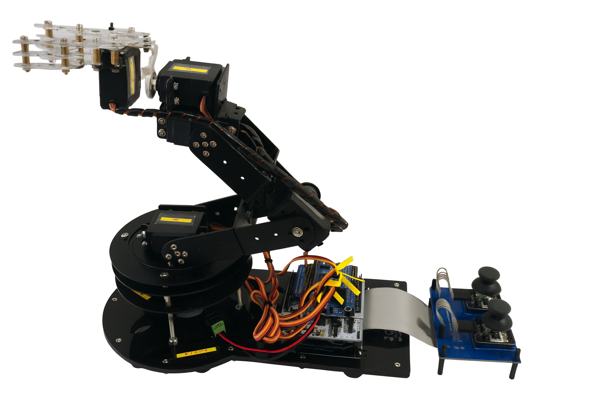
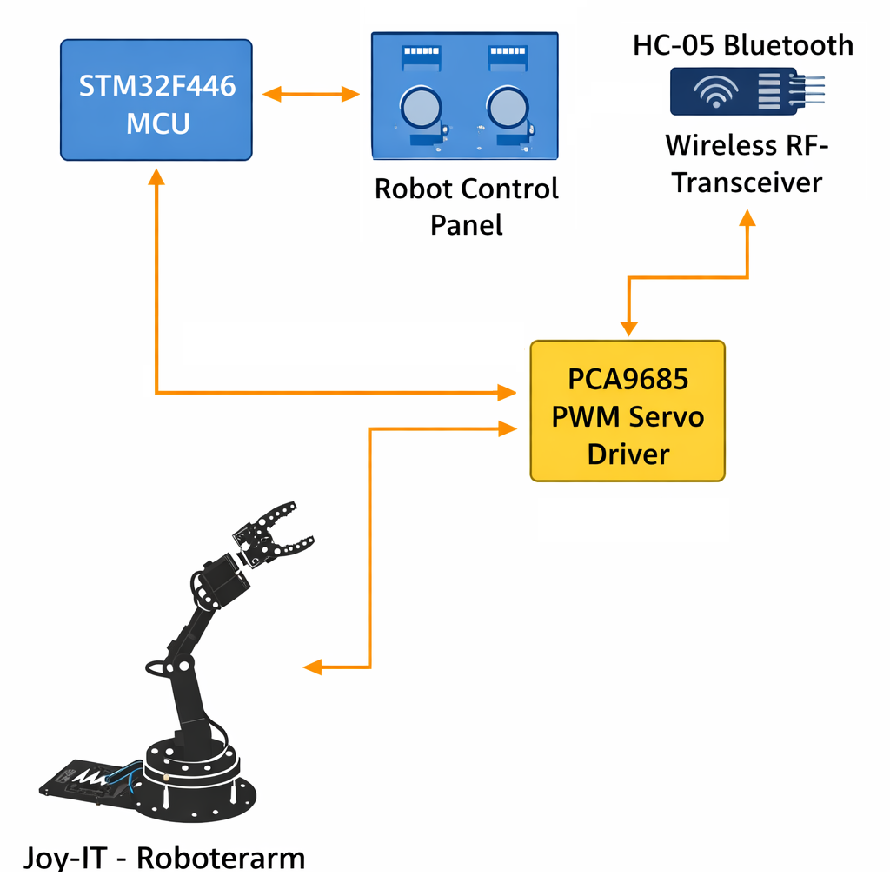
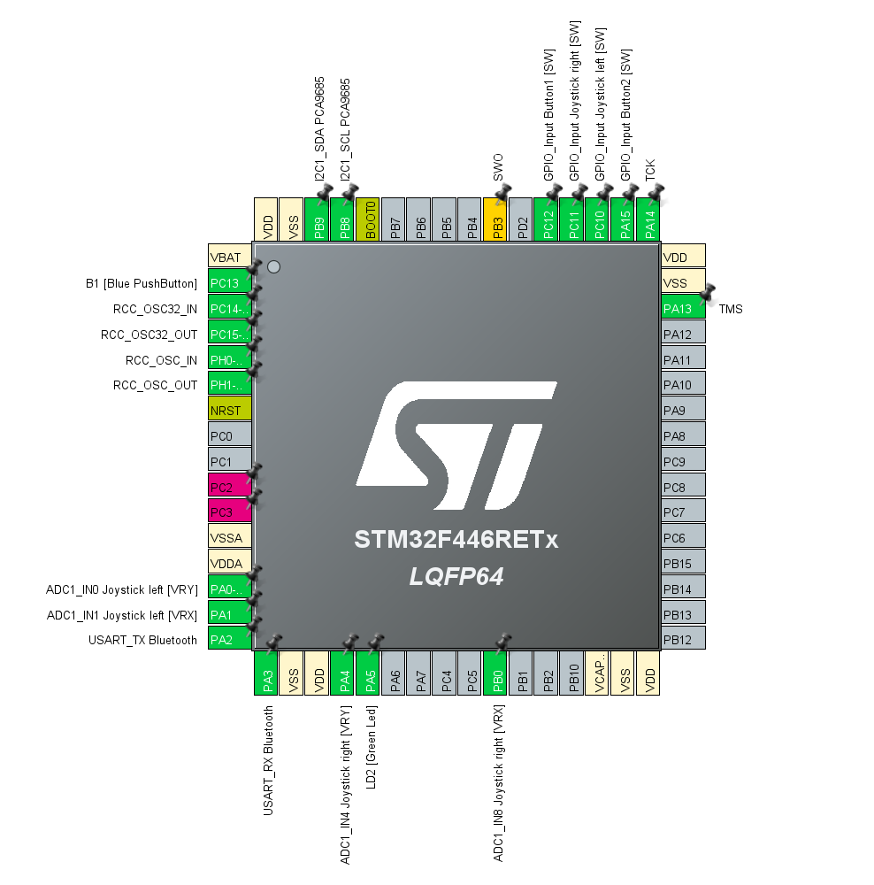
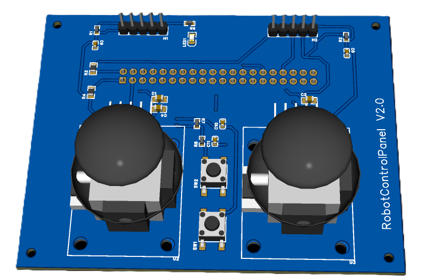
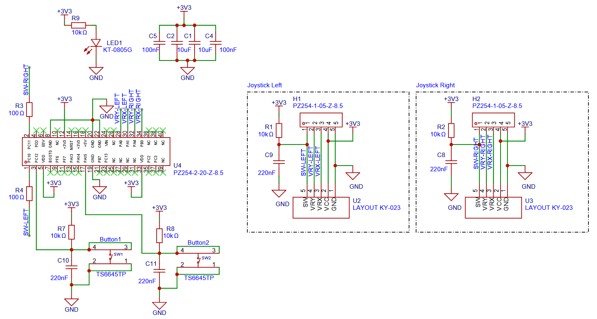
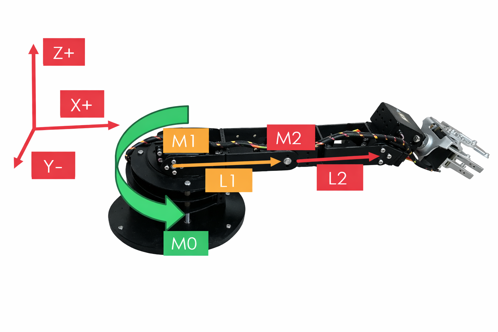

# Robot Arm Controller Firmware

Embedded firmware for a **6-DOF robotic arm with gripper** based on an STM32 microcontroller.
The project combines low-level hardware access in C with higher-level control logic in C++ and provides both **manual joystick control** and **automatic positioning using forward and inverse kinematics**.

<p align="center">
  <br>
  <em>Demo: Robotic arm movement and control.</em>
</p>

<p align="center">
  <br>
  <em>Figure: Robotic arm hardware prototype.</em>
</p>

## Engineering Highlights

- Deterministic 100 Hz control loop using timer interrupt scheduling
- Continuous ADC acquisition via DMA
- Hybrid C / C++ architecture with clear module separation
- Forward and inverse kinematics
- Smooth servo interpolation
- Emergency stop safety concept

The software is designed with a modular architecture to ensure a clear separation between hardware abstraction, motion control, mathematical modelling, configuration data and shared data structures. This improves readability, maintainability and extensibility of the codebase.

This project was developed as part of personal advanced training in embedded C / C++ and robotics (see [Disclaimer](#disclaimer)).

---

## Table of Contents

- [Project Overview](#project-overview)
- [How the System Works](#how-the-system-works)
- [Objectives](#objectives)
- [Key Features](#key-features)
- [Hardware Platform](#hardware-platform)
- [Software Architecture](#software-architecture)
- [Project Structure](#project-structure)
- [Module Description](#module-description)
  - [Configuration (`config/`)](#configuration-config)
  - [Control Logic (`controller/`)](#control-logic-controller)
  - [Hardware Abstraction (`hardware/`)](#hardware-abstraction-hardware)
    - [ADC](#adc)
    - [GPIO](#gpio)
    - [Timer](#timer)
    - [USART](#usart)
    - [I²C](#i2c)
  - [Functional Libraries (`libraries/`)](#functional-libraries-libraries)
    - [Diagnostic Logger](#diagnostic-logger)
    - [Joystick](#joystick)
    - [Kinematics](#kinematics)
    - [PCA9685 Servo Driver](#pca9685-servo-driver)
    - [Servo Controller](#servo-controller)
  - [Data Model (`model/`)](#data-model-model)
  - [Application Entry Point (`main.cpp`)](#application-entry-point-maincpp)
- [Control Concept](#control-concept)
  - [Manual Mode](#manual-mode)
  - [Automatic Mode](#automatic-mode)
- [Kinematics Concept](#kinematics-concept)
- [Timing and Real-Time Behaviour](#timing-and-real-time-behaviour)
- [Safety Mechanisms](#safety-mechanisms)
- [Development Environment](#development-environment)
- [Build Notes](#build-notes)
- [Possible Future Improvements](#possible-future-improvements)
- [Disclaimer](#disclaimer)
- [Project Information](#project-information)
- [License](#license)
- [Third-Party Components](#third-party-components)

---

## Project Overview

The purpose of this project is to control a robotic arm with multiple axes using an STM32 microcontroller.  
The system allows the arm to be operated in two different ways:

1. **Manual mode**, in which the user directly controls the robot by means of analog joysticks and buttons.
2. **Automatic mode**, in which the robot moves to predefined Cartesian target positions by calculating the required joint angles through inverse kinematics.

The firmware integrates several functional areas:

- hardware-oriented peripheral control,
- input acquisition,
- motion control,
- mathematical kinematics,
- diagnostic output,
- and structured software coordination.

The overall goal is to provide a clean and technically robust embedded software architecture for robotics applications.

---

## How the System Works

1. The joystick panel generates analog and digital control signals.
2. ADC and GPIO drivers continuously acquire the input state.
3. The RobotController evaluates the selected operating mode.
4. In manual mode, target joint angles are updated directly from joystick input.
5. In automatic mode, inverse kinematics calculates joint targets from Cartesian coordinates.
6. The ServoController interpolates motion toward the target angles.
7. The PCA9685 generates PWM signals to drive the servos.

---

## Objectives

The software was designed with the following objectives in mind:

- Clear separation between hardware-dependent and hardware-independent code
- Reusable and maintainable software modules
- Safe and controlled motion of the robotic arm
- Support for both manual and automatic control strategies
- Reliable periodic control execution
- Easy adaptation to different mechanical robot configurations
- Good traceability and diagnostic capability during development

---

## Key Features

- Manual robotic arm control using analog joysticks
- Automatic point-to-point movement using inverse kinematics
- Forward kinematics for position calculation from joint angles
- Smooth servo movement using gradual target interpolation
- Servo offset correction and servo direction inversion support
- Emergency stop functionality
- Modular hardware abstraction for STM32 peripherals
- Continuous ADC acquisition using DMA
- Debug logging via USART and Bluetooth
- Clean separation between C-based drivers and C++ application logic

---

## Hardware Platform

<p align="center">
  <br>
  <em>Figure: Hardware architecture of the robotic arm control platform.</em>
</p>

### STM32 Pin Configuration

<p align="center">
  <br>
  <em>Figure: STM32CubeMX pin configuration used for the robotic arm controller firmware.</em>
</p>

The following figure shows the STM32 pin assignment and peripheral configuration
used in the project. It illustrates the mapping of ADC channels, GPIO inputs,
USART debug output and the I²C connection to the PCA9685 servo controller.

The configuration was created with STM32CubeMX and reflects the hardware setup
used by the firmware on the Nucleo-F446RE platform.

The corresponding STM32CubeMX project file (`.ioc`) is included in the repository.

The firmware is designed for the following hardware components:

- **Microcontroller Platform:** ST Nucleo-F446RE development board (STM32F446RE, ARM Cortex-M4)
- **Robot Manipulator Platform:** Joy-IT multi-axis robotic arm kit with integrated hobby servo drives
- **External PWM Servo Controller:** Adafruit PCA9685 16-Channel PWM Servo Shield (I²C interface)
- **Wireless Debug Communication Module:** HC-05 Bluetooth serial transceiver connected to a UART interface of the microcontroller (TX debug output)
- **Manual Control Interface:** Custom dual-axis analog joystick robot control panel PCB
- **Digital Input Devices:** Emergency stop push button, automatic mode selection switch and joystick push buttons located on the control panel
- **Control Panel Interconnection Cable:** 
  40-pin IDC ribbon cable extension (approx. 10 cm) used to connect the 
  custom joystick control panel PCB with the STM32 control electronics.

### External Servo Controller (PCA9685 Servo Shield)

The robotic arm servos are driven by an external PWM controller.

The system uses an  
**Adafruit 16-Channel PWM / Servo Shield (PCA9685, I²C interface)**  
which provides 12-bit PWM signal generation for up to 16 servo channels.

Key characteristics:

- I²C controlled PWM generation
- 12-bit resolution
- Configurable output frequency (typically 50 Hz for hobby servos)
- Stackable shield design
- Logic voltage compatible with 3.3 V and 5 V systems
- Maximum PWM frequency up to approx. 1.6 kHz

The shield is connected to the STM32 microcontroller via the I²C bus and is responsible for generating all servo control signals.

The servo supply voltage is provided by an external power supply
connected directly to the servo shield power terminals.
The microcontroller board is not used to power the servos.

A common ground connection between the servo power supply,
servo shield and microcontroller is required for reliable operation.

### Servo Channel Assignment

Each robot axis servo is connected to a dedicated PWM output channel of the servo shield.

| Motor ID | Robot Axis | PCA9685 PWM Channel |
|---------|-----------|---------------------|
| Motor 0 | A1 – Base rotation | PWM channel 0 |
| Motor 1 | A2 – Shoulder axis | PWM channel 1 |
| Motor 2 | A3 – Elbow axis | PWM channel 2 |
| Motor 3 | A4 – Tool tilt | PWM channel 3 |
| Motor 4 | A5 – Wrist rotation | PWM channel 4 |
| Motor 5 | G6 – Gripper | PWM channel 5 |

The remaining PWM channels are currently unused and may be used for future extensions such as additional degrees of freedom or auxiliary actuators.

### User Documentation

Detailed instructions for operating the robotic arm,
including axis control, joystick functions and automatic motion sequences,
are provided in the user manual:

**[Robotic Arm User Manual](docs/user-manual.md)**

### Analog Input Channels

The joystick positions are acquired through ADC channels:

- `PA0` → Left joystick X-axis
- `PA1` → Left joystick Y-axis
- `PA4` → Right joystick X-axis
- `PB0` → Right joystick Y-axis

### Digital Input Pins

The push buttons are connected to:

- `PC10` → Left joystick button
- `PC11` → Right joystick button
- `PC12` → Emergency stop button
- `PA15` → Automatic mode on/off button

### USART Interface

- `PA2` → USART2 TX
- `PA3` is not used in this application

The TX signal is connected to an HC-05 Bluetooth module for wireless output of debug messages.

### Control Panel

<p align="center">
  <br>
  <em>
    Figure: Custom dual-joystick robot control panel PCB (EasyEDA Pro).<br>
    The joystick 3D model shown is “Joystick KY-023” by Thingiverse user UniversalXx,<br>
    licensed under Creative Commons Attribution-ShareAlike (CC-BY-SA):<br>
    https://www.thingiverse.com/thing:7005492
  </em>
</p>

<br>

<p align="center">
  <br>
  <em>Figure: Custom dual-joystick robot control panel circuit (EasyEDA Pro).</em>
</p>

<br>

For this project, a dedicated control panel PCB was specifically designed and developed using EasyEDA Pro.

The panel provides all necessary manual control inputs in a compact and robust hardware interface.  
It integrates two analog joystick modules and multiple push buttons for mode selection and safety control.

#### Main Features

- Dual analog joystick modules for intuitive multi-axis manual control  
- Integrated joystick push buttons for additional control functions  
- Dedicated emergency stop button for safe operation  
- Automatic mode selection button  
- External pin headers for connection to the STM32 control electronics  
- Clearly structured PCB layout with mounting holes for mechanical fixation  

#### Electrical Interface

The control panel connects directly to the microcontroller board and provides:

- **Analog outputs** from joystick potentiometers routed to ADC input channels  
- **Digital switch signals** for joystick buttons, emergency stop and mode selection  
- **Common ground and supply routing** through board connectors  

The PCB was designed to ensure reliable signal routing, low electrical noise on analog inputs and easy mechanical integration into the robot control housing.

This dedicated hardware interface enables precise and ergonomic real-time control of the robotic arm during manual operation.

---

## Software Architecture

The firmware follows a layered and modular software structure.  
The main idea behind the architecture is to separate concerns so that hardware access, application control logic, data handling and mathematical processing remain clearly distinguishable.

At a high level, the project can be divided into the following areas:

- **Configuration layer**  
  Static robot and system parameters
- **Hardware abstraction layer**  
  Peripheral-specific drivers
- **Functional libraries**  
  Reusable robot-specific logic
- **Data model layer**  
  Shared simple data structures
- **Application layer**  
  Startup and system orchestration

This modular approach makes it easier to extend the robot, replace hardware-specific implementations or adapt the system to other robot configurations.

---

## Project Structure

```text
.
├── config/
├── controller/
├── hardware/
│   ├── adc/
│   ├── gpio/
│   ├── i2c/
│   ├── timer/
│   └── usart/
├── libraries/
│   ├── diagnostic/
│   ├── joystick/
│   ├── kinematics/
│   ├── pca9685/
│   └── servo/
├── model/
└── main.cpp
````

---

## Module Description

## Configuration (`config/`)

The `config` directory contains the robot-specific configuration data.

A central file in this directory is:

* `robot_config.hpp`

This file defines configuration parameters such as:

* servo offset values,
* servo inversion settings,
* arm segment lengths,
* movement limits,
* startup angles,
* and other robot-specific constants.

These parameters are grouped into structures and declared as constants.
This ensures that configuration data remains fixed during runtime and cannot be modified unintentionally by application logic.

This design also simplifies adaptation of the firmware to a modified robotic arm, because geometry and servo settings can be changed in one central place without affecting the rest of the implementation.

---

## Control Logic (`controller/`)

The control layer contains the central control logic of the robotic arm.

The key class is:

* `RobotController`

This class acts as the central coordinator of the system and connects the main functional components:

* `Joystick`
* `Kinematics`
* `ServoController`

These components are passed to the controller by reference, which keeps ownership outside the controller and avoids unnecessary coupling.

### Responsibilities of `RobotController`

* moving the robot into a defined startup or reference position,
* storing and managing current joint angle values,
* configuring servo offsets and inversion for kinematics,
* evaluating user inputs,
* switching between manual and automatic mode,
* initiating automatic object transport routines,
* calling the motion controller with updated target values.

### Control Cycle

The controller is executed periodically through a dedicated update routine.
A timer interrupt triggers the control cycle every 10 ms.
When the corresponding control flag is set, the main loop calls the periodic update method of the controller.

This method is responsible for evaluating the current system state and choosing the correct control strategy depending on the selected operating mode.

---

## Hardware Abstraction (`hardware/`)

The `hardware` directory contains low-level, hardware-oriented C libraries for the STM32 peripherals.
These modules encapsulate direct register configuration and peripheral-specific implementation details.

This separation keeps the higher-level C++ logic independent of hardware register handling.

### ADC

The ADC driver is responsible for reading the analog joystick positions.

#### Main Characteristics

* Four analog channels are sampled
* ADC is configured in scan mode
* ADC runs continuously
* DMA transfers results automatically into RAM
* The CPU can access the current input values at any time

#### Used Channels

* `PA0` → Left joystick X
* `PA1` → Left joystick Y
* `PA4` → Right joystick X
* `PB0` → Right joystick Y

The measured values are written into an array such as `adc_values[4]`.

Since DMA handles the transfer automatically, the CPU does not need to poll conversion results manually.
This reduces processing overhead and allows responsive input handling.

The conversion sequence for all four channels takes approximately 495 µs, meaning that fresh values are available continuously.

Because the values are stored as 16-bit quantities on a 32-bit system, reads are effectively safe for the intended use case in this design.

---

### GPIO

The GPIO driver handles the digital inputs of the control panel.

#### Defined Inputs

* `PC10` → Left joystick button
* `PC11` → Right joystick button
* `PC12` → Emergency stop
* `PA15` → Auto mode on/off

The pins are configured as digital inputs.

An external pull-up network is already available on the hardware, therefore no internal pull-up configuration is required and the corresponding configuration uses no internal pull resistor.

Because the buttons pull the line to low level when pressed, the electrical logic is active-low.
For easier use in the software, the read functions return an inverted logical value so that a pressed button corresponds to a logical high or `true`.

This simplifies application-level processing and makes the input semantics more intuitive.

---

### Timer

The timer subsystem is divided into two different purposes.

#### 1. Periodic Control Interrupt (TIM7)

A timer-based interrupt using TIM7 is configured to trigger every 10 ms.

Its job is not to execute the entire robot logic directly inside the interrupt, but rather to set a control flag.
The actual control logic is then executed in the main program context when this flag is detected.

This is a common and robust embedded design pattern because it keeps the interrupt routine short and predictable while still enabling periodic control execution.

#### 2. SysTick Timer

The system also uses the ARM CMSIS-based SysTick timer.

It is configured to generate an interrupt every 1 ms.
Inside the `SysTick_Handler`, a millisecond counter is incremented.

This counter can be used for:

* delays,
* timeout handling,
* simple time measurements,
* scheduling helper functions.

The counter is typically defined as `volatile` to ensure correct access from both interrupt context and main program flow.

---

### USART

The USART driver provides debug output over the STM32 USART2 peripheral.

#### Main Characteristics

* Uses `USART2`
* TX only
* Baud rate: `9600`
* Format: `8N1`
* TX pin: `PA2`

The RX pin is not configured because the application does not require receiving data over USART.

The transmitted debug output is routed to an HC-05 Bluetooth module.
This allows a paired external device, such as a PC or smartphone, to display log messages wirelessly in a serial terminal.

This is particularly useful during development and testing, because it enables insight into the internal system state without requiring a wired debugging console.

---

### I2C

The I²C interface is used for communication with the PCA9685 servo driver.

The low-level I²C implementation is located in the hardware abstraction layer and provides the communication foundation for register-based access to the PWM controller.

This layer is intentionally separated from the higher-level PCA9685 logic so that the actual device driver remains focused on PWM-related functionality rather than generic bus handling.

---

## Functional Libraries (`libraries/`)

The `libraries` area contains reusable functional modules implemented mostly in C++.

These modules build upon the hardware abstraction layer and provide robot-specific application behaviour.

---

### Diagnostic Logger

The diagnostic module provides a logging facility for development and debugging.

The implementation consists of:

* a C-based logger,
* and a C++ wrapper class.

This design allows the logger to be used from both C and C++ code.

#### Features

* formatted output similar to `printf`
* central initialization
* forwarding to USART output
* convenient static C++ interface

The wrapper class provides static methods so that no logger object instance has to be created.

This makes logging easy to use from any software module while preserving a simple C-based backend implementation.

---

### Joystick

The joystick module provides a C++ abstraction of the user input panel.

Its main task is to read and store the current state of all relevant input elements:

* analog joystick axes,
* joystick push buttons,
* emergency stop button,
* automatic mode button.

### Responsibilities

* acquire current ADC values,
* map them to joystick axes,
* read button states from GPIO,
* store the complete current input state,
* provide accessor functions for higher-level logic.

Dedicated methods such as `isEmergencyStop()` and `isAutoModeOn()` allow convenient access to important control signals.

The joystick class therefore acts as a bridge between low-level hardware input acquisition and high-level application decisions.

---

### Kinematics

The kinematics module implements the mathematical model of the robotic arm.

It is responsible for converting between:

* **joint space** (servo / joint angles),
* and **Cartesian space** (x, y, z position).

#### Core Functionality

* forward kinematics,
* inverse kinematics,
* servo offset correction,
* servo inversion handling,
* configurable arm geometry.

When a `Kinematics` object is created, the arm segment lengths are provided, typically:

* `L1` → upper arm length
* `L2` → forearm length

These geometric values are used for all kinematic calculations.

#### Forward Kinematics

The forward kinematics function calculates the current Cartesian end-effector position from the current joint angles.

Input:

* motor angles

Output:

* position vector `Vec3`

  * `x`
  * `y`
  * `z`

This is useful for determining the actual gripper position corresponding to a given set of motor angles.

#### Inverse Kinematics

The inverse kinematics function performs the inverse calculation.

Input:

* desired target position `(x, y, z)`

Output:

* result structure containing

  * validity flag,
  * calculated motor angles.

This allows the robot to move to predefined positions in space.

#### Offset and Inversion Handling

Because the physical installation of servos may differ from the ideal mathematical reference system, the module supports:

* per-servo angular offsets,
* per-servo inversion settings.

These corrections are handled through internal helper functions that convert between motor angles and kinematic angles.

This is essential because the kinematic model must use a consistent reference frame even if the actual servo installation differs mechanically.

---

### PCA9685 Servo Driver

The PCA9685 driver controls the external PWM controller used for the servos.

The PCA9685 is connected via I²C and provides 12-bit PWM generation for multiple channels.

#### Main Characteristics

* internal oscillator: 25 MHz
* standard I²C address: `0x40`
* PWM resolution: 12 bit
* servo frequency: typically 50 Hz

A frequency of 50 Hz is commonly used because standard hobby servos expect a control period of approximately 20 ms.

#### Driver Tasks

* configure the controller,
* set prescaler for desired PWM frequency,
* configure operating mode,
* enable auto-increment for sequential register writes,
* convert pulse widths into PWM tick values,
* write PWM settings to the selected output channel.

The function for setting a servo pulse width accepts a value in microseconds and converts it into the tick-based representation required by the PCA9685.

This makes the interface intuitive for servo control because pulse widths such as 500 µs to 2000 µs directly correspond to mechanical servo positions.

---

### Servo Controller

The servo controller implements the high-level regulation and movement of the robotic arm servos.

The central class is:

* `ServoController`

#### Responsibilities

* store current and target angles,
* enforce servo and mechanical limits,
* calculate pulse widths from angles,
* move servos step by step toward target positions,
* control motion speed,
* prevent motion in emergency stop conditions.

#### Initialization

During startup, the servo controller sets:

* minimum and maximum pulse widths,
* minimum and maximum servo angles,
* additional mechanical limit ranges,
* initial startup angles.

The servos are then moved into a defined initial position, providing a known reference state for the robot after power-up.

#### Smooth Motion

Instead of jumping directly to the target angle, the controller gradually approaches the target.

This is typically done by:

* calculating the difference between current angle and target angle,
* moving in small steps,
* waiting for a configurable delay between steps.

This leads to smoother and safer motion.

#### Safety Behaviour

Before commanding servo movement, the controller checks the emergency stop condition.
If the emergency stop is active, no movement commands are sent to the servos.

This helps avoid undesired behaviour in critical situations.

---

## Data Model (`model/`)

The `model` directory contains shared data structures used as lightweight data transfer objects.

These structures do not contain complex behaviour.
Their purpose is to hold and transfer data between modules in a clean and structured manner.

Examples include:

* `JointAngles`
* `JoystickState`
* `ServoLimits`

An enumeration such as `ServoID` is also used to provide readable identifiers for the robot servos.

This improves code clarity and reduces the risk of errors that may occur when using raw numeric indices.

---

## Application Entry Point (`main.cpp`)

The firmware starts in `main.cpp`.

This file contains the application entry point and performs the overall startup sequence of the system.

### Startup Sequence

Typical initialization tasks include:

* system clock initialization,
* logger initialization,
* timer initialization,
* SysTick initialization,
* I²C initialization,
* ADC initialization,
* GPIO initialization,
* PCA9685 initialization,
* creation of the main software components.

After hardware and basic services are initialized, the main objects are created, for example:

* `Joystick`
* `Kinematics`
* `ServoController`
* `RobotController`

The `RobotController` receives references to the other objects, but ownership remains in `main()`.
This keeps dependencies explicit and avoids unnecessary dynamic allocation or hidden ownership transfer.

### Main Loop

After initialization, the application enters an infinite loop.

The actual robot control is not executed continuously without structure, but rather synchronized by the periodic control tick set by the timer interrupt.

When the control flag is detected in the loop, the periodic update function of the controller is called.

This architecture is well suited for embedded systems because it offers deterministic scheduling while keeping the implementation understandable and maintainable.

---

## Control Concept

The robot supports two main operating modes.

---

## Manual Mode

In manual mode, the robot is controlled directly by the user through the joystick panel.

The controller continuously evaluates:

* analog joystick positions,
* joystick button states,
* additional control buttons.

Depending on the input, the target angle of a corresponding axis is increased or decreased.

The updated target values are then passed to the servo controller, which moves the servos toward these values while enforcing all configured limits.

This operating mode allows intuitive direct control of the robot arm.

---

## Automatic Mode

In automatic mode, predefined target coordinates can be used.

The sequence is conceptually as follows:

1. A desired Cartesian target position `(x, y, z)` is defined.
2. The inverse kinematics module calculates the required joint angles.
3. The resulting joint angles are passed to the servo controller.
4. The servo controller moves the arm smoothly to the target position.

This allows the robotic arm to move between known spatial points in a controlled and repeatable manner.

Automatic mode is especially useful for tasks such as point-to-point transport or pick-and-place style motion.

---

## Kinematics Concept

The kinematics model is a central element of the project because it allows the software to translate between mathematical robot motion and actual servo commands.

### Current Kinematic Model Limitations

The current kinematic implementation models only two arm segments:

<p align="center">
  
  <br>
  <em>
  Figure: Current simplified kinematic model.
  Inverse kinematics is solved for the wrist joint position.
  Tool center point offsets caused by the physical gripper length are not yet considered.
  </em>
</p>

- L1 → upper arm  
- L2 → forearm  

The effective tool center point is currently assumed to coincide with the wrist joint axis.

A possible additional offset caused by the physical gripper length is currently not included  
in the inverse kinematics model.

This modelling simplification is an intentional design decision and was chosen deliberately to:

- reduce mathematical complexity  
- simplify initial testing and validation  
- focus on reliable base functionality on the embedded target system  

The current software architecture already allows future extension of the kinematic model  
without major structural changes.

Future versions of the firmware may extend the inverse kinematics model  
by introducing a tool center point offset parameter.

### Kinematic Reference Alignment (Servo Offset Calibration)

For correct operation of the kinematic model, each robot joint must be aligned  
to a defined mechanical reference position.

In the current implementation, the kinematic zero position is defined such that:

- the arm segments are oriented forward as shown in the figure  
- this physical pose corresponds to **0° joint angle** in the mathematical model  

Because hobby servos cannot be mounted with perfect angular precision,  
a per-joint **servo offset calibration** is required.

The calibration procedure is conceptually as follows:

1. Move the robot manually or via software into the defined reference pose  
   (all arm segments aligned in the forward direction).
2. Measure or estimate the deviation between the physical servo position  
   and the desired mathematical zero angle.
3. Store this deviation as a fixed offset parameter for the corresponding joint.
4. During runtime, the kinematics module compensates this offset  
   when converting between kinematic joint angles and servo command angles.

This ensures that:

- a kinematic angle of **0°** results in the correct physical arm orientation  
- forward and inverse kinematics operate on a consistent geometric model  
- installation tolerances and mechanical mounting errors are compensated  

### Why Offsets Are Necessary

The mathematical kinematic model assumes a clearly defined zero reference position.  
In the real mechanical system, however, the servos may not be mounted exactly in that reference orientation.

Therefore, offset values are used to align the servo reference positions with the kinematic model.

### Why Inversion Is Necessary

Depending on servo installation and linkage direction, a positive motor command  
may correspond either to a positive or a negative mathematical rotation.

The inversion settings allow the software to handle this cleanly  
without changing the kinematic formulas themselves.

### Result

By separating the pure kinematic model from installation-dependent corrections,  
the code remains mathematically clean while still being adaptable to the physical robot.

---

## Timing and Real-Time Behaviour

Timing is an important aspect of embedded robotics software.

This project uses two relevant periodic mechanisms:

### Control Cycle

* Triggered every 10 ms by TIM7
* Used to schedule the robot controller update

This ensures that control logic is executed periodically and predictably.

### Time Base

* 1 ms resolution using SysTick
* Used for delays, timing and helper functions

### ADC Behaviour

* Continuous conversion with DMA
* New joystick values are always available
* CPU is relieved from repeated manual polling

This architecture supports responsive user input handling while keeping the main control structure deterministic.

---

## Safety Mechanisms

The project contains several safety-related mechanisms.

### Emergency Stop

A dedicated emergency stop input can disable movement commands.

### Angle Limits

Servo motions are constrained by configured electrical and mechanical angle limits.

### Controlled Motion

Target positions are approached gradually instead of through abrupt jumps.

### Structured Control Scheduling

The control logic is executed through a periodic scheduling concept rather than uncontrolled direct processing.

Together, these measures reduce the risk of invalid or dangerous movements and improve system robustness.

---

## Development Environment

The project was developed using:

* **IDE:** SEGGER Embedded Studio
* **Languages:** C and C++
* **Microcontroller Support:** CMSIS
* **Target Platform:** STM32F446RET6

The combination of C and C++ was chosen deliberately:

* C is used for low-level hardware-near code,
* C++ is used for modular application logic and abstraction.

This combines efficiency and direct hardware control with structured object-oriented design.

---

## Build Notes

This repository contains embedded firmware code intended for an STM32-based target system.

To build and run the project successfully, the following are typically required:

* a compatible ARM embedded toolchain,
* SEGGER Embedded Studio project configuration,
* the target hardware setup,
* and the required connected peripherals such as joystick, servos and PCA9685 module.

Because this is embedded target firmware, the project is not intended to be compiled as a generic desktop application.

---

## Possible Future Improvements

Potential future extensions of the project include:

* extension of the inverse kinematics model by introducing
  a tool center point offset (distance from wrist joint to gripper tip),
  enabling accurate Cartesian positioning of the end effector
* trajectory planning instead of simple point-to-point movement,
* acceleration and deceleration profiles for smoother motion,
* closed-loop feedback using sensors,
* serial command interface for PC-based control,
* teach-in positions and programmable motion sequences,
* calibration mode for servo offsets,
* non-volatile storage of robot parameters,
* extended diagnostics and telemetry output.

These additions could further increase usability, safety and technical sophistication.

---

## Disclaimer

This project is intended for educational and experimental use only.

It is not intended for use in safety-critical, medical, industrial,
or commercial applications.

The firmware is provided "as is", without any warranty of any kind.
Use of this software and any associated or connected hardware is entirely at your own risk.

The author shall not be liable for any damage, malfunction, data loss,
personal injury, or other consequences resulting from the use,
modification, integration, or reproduction of this project,
including firmware, hardware designs, schematics, or PCB layouts.

---

## Project Information

- Author: Manuel Wiesinger
- Initial development: March 2026
- Status: Functional prototype

---

## License

MIT License

Copyright (c) 2026 Manuel Wiesinger

See the LICENSE file for details.

---

## Third-Party Components

This repository includes third-party embedded support software such as:

- ARM CMSIS Core
- STMicroelectronics CMSIS Device (STM32F4)
- SEGGER startup, linker and support files

These components remain under their respective licenses.
See the `third_party/` directory and individual file headers for details.

---
