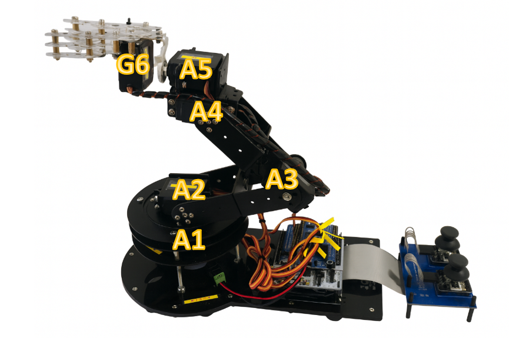
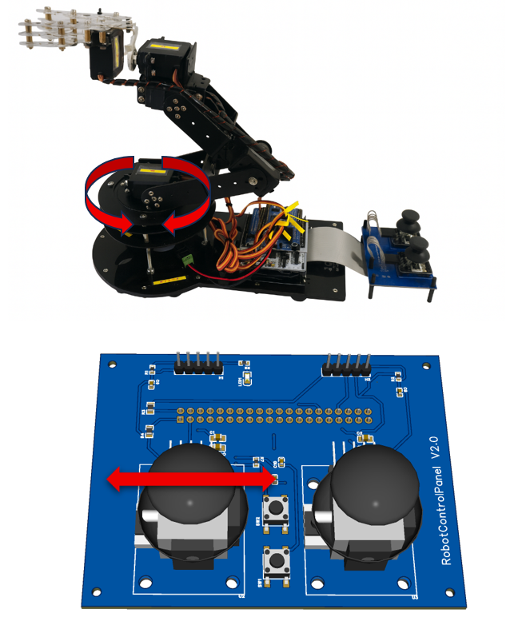
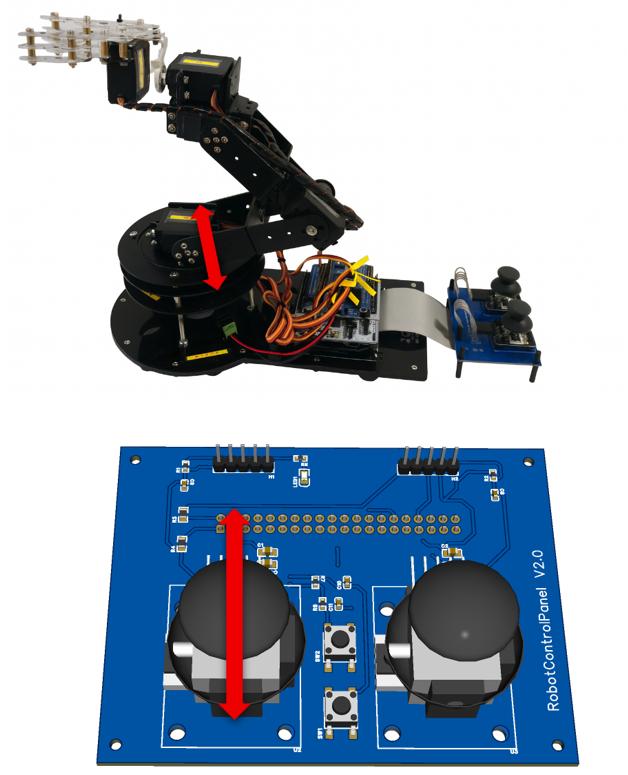
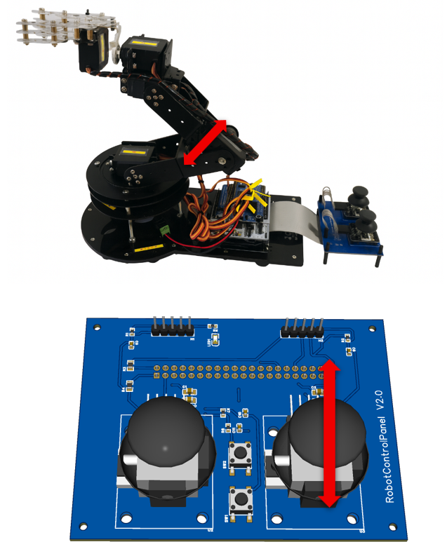
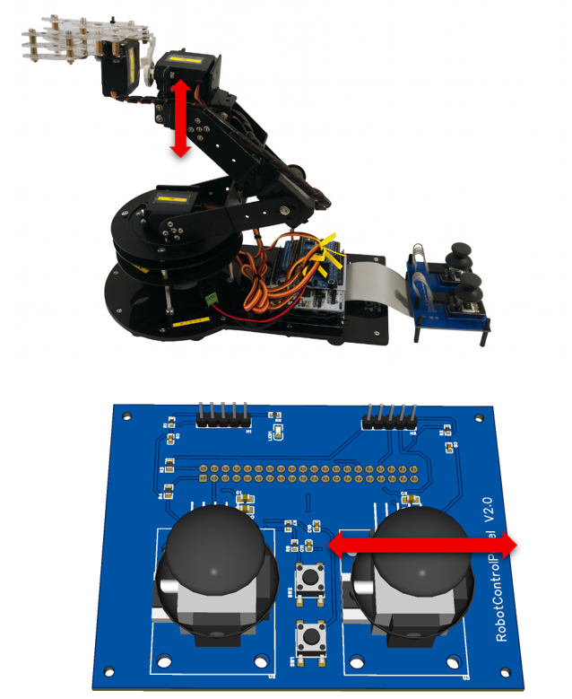
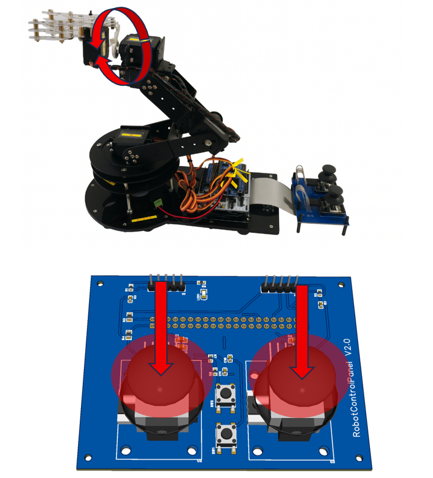
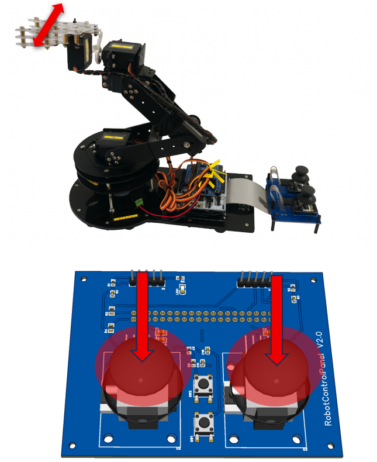
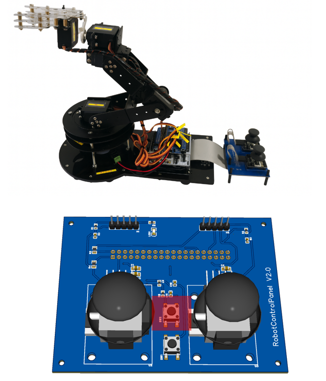
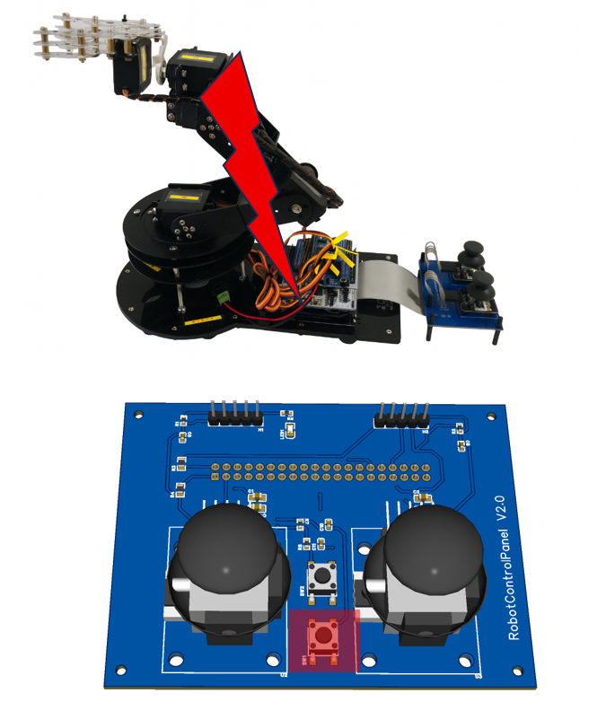

# Robotic Arm User Manual

This document describes the operation and safe use of the robotic arm system.

The robotic arm is designed for automated picking, transportation and precise placement of workpieces between defined positions.

The system supports:

- Manual joystick control  
- Automatic execution of predefined motion sequences  

---

## Image Attribution

Some figures in this document include a joystick 3D model.

The joystick model “Joystick KY-023” by Thingiverse user UniversalXx  
is licensed under Creative Commons Attribution-ShareAlike (CC-BY-SA).

Full attribution details are provided in the main project README.

---

## System Startup and Referencing

After power-up the robotic arm automatically performs a referencing procedure.

All axes move to their defined home positions to establish a consistent internal coordinate reference.

⚠️ Do not interfere with the robot during referencing.

The system is ready for operation only after successful completion.

  
  
<em>Figure: Automatic referencing movement after system startup.</em>

---

## Axis Overview

### Axis 1 – Base Rotation (A1)

Rotates the entire robotic arm around the vertical axis.

  
  
<em>Figure: Axis 1 – base rotation.</em>

### Axis 2 – Shoulder Axis (A2)

Moves the arm vertically and defines working height.

  
  
<em>Figure: Axis 2 – shoulder movement.</em>

### Axis 3 – Elbow Axis (A3)

Extends or retracts the arm and enables positioning in depth direction.

  
  
<em>Figure: Axis 3 – elbow movement.</em>

### Axis 4 – Tool Tilt Axis (A4)

Tilts the gripper up and down to adjust tool orientation.

  
  
<em>Figure: Axis 4 – gripper tilt.</em>

### Axis 5 – Wrist Rotation (A5)

Rotates the gripper around its longitudinal axis.

**Activation**

Press both joystick push buttons simultaneously while both joysticks are in the neutral position.

After activation:

- Press left joystick → rotate in one direction  
- Press right joystick → rotate in opposite direction  

  
  
<em>Figure: Axis 5 – wrist rotation control.</em>

### Axis 6 – Gripper (G6)

Opens and closes the gripper for workpiece handling.

**Activation**

Press both joystick push buttons simultaneously to switch from wrist rotation mode back to gripper control mode.

- Press left joystick → open gripper  
- Press right joystick → close gripper  

  
  
<em>Figure: Gripper opening and closing.</em>

---

## Operating Modes

### Manual Mode

In **Manual Mode**, the robotic arm is controlled directly via the joystick control panel.

- Joystick movement controls axis direction and speed  
- Push buttons control tool functions  

Manual Mode is intended for:

- Setup and adjustment  
- Testing movements  
- Maintenance  
- Teaching positions  

  
  
<em>Figure: Manual operation using the dual-joystick control panel.</em>

### Automatic Mode

In **Automatic Mode**, the robotic arm executes predefined motion sequences.

Typical process:

1. Move to pick position  
2. Grip workpiece  
3. Transport along programmed path  
4. Place workpiece at target position  

Manual joystick inputs are disabled during automatic operation.

  
  
<em>Figure: Automatic workpiece transport cycle.</em>

---

## Emergency Stop

The system includes an emergency stop function.

When activated:

- All robot motion stops immediately  

Before restarting operation:

- Inspect the system  
- Resolve the cause of the stop condition  

  
  
<em>Figure: Emergency stop button on control panel.</em>

---