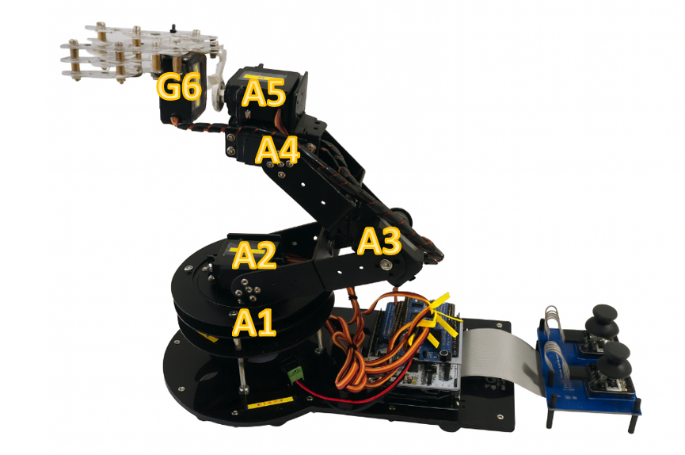
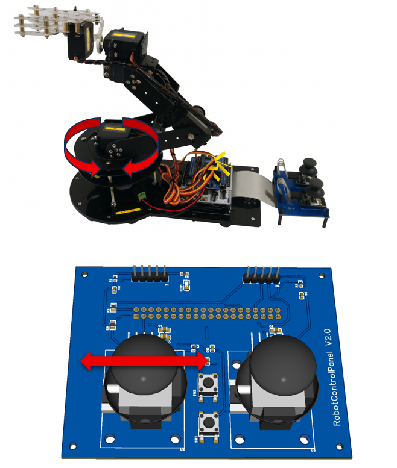
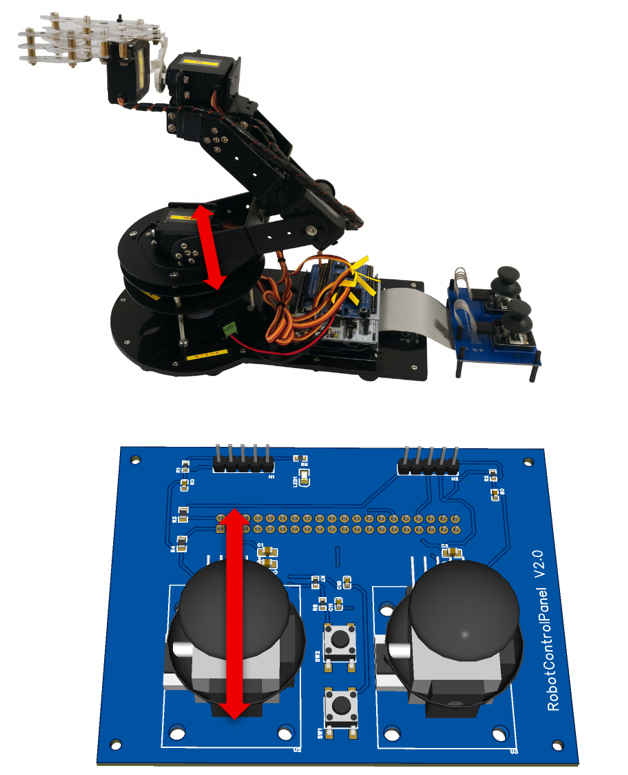
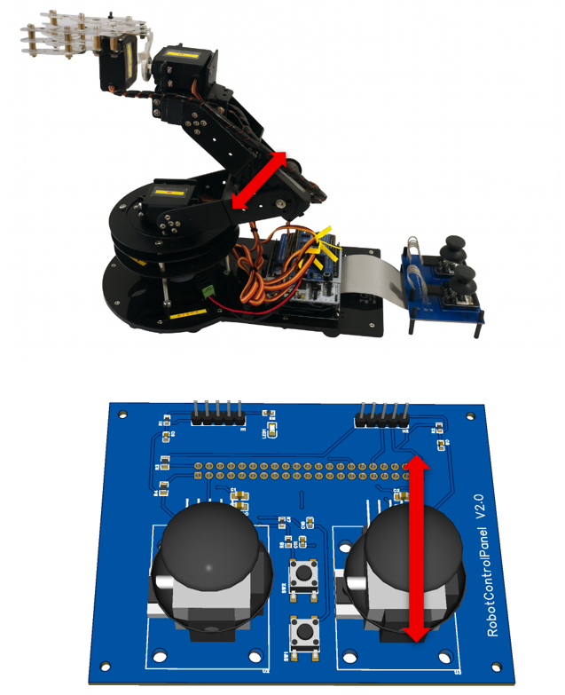
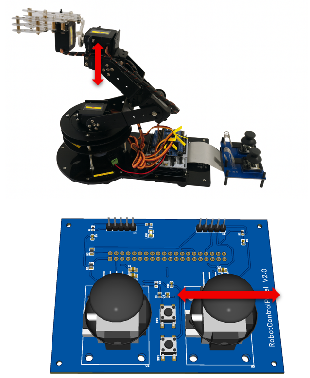
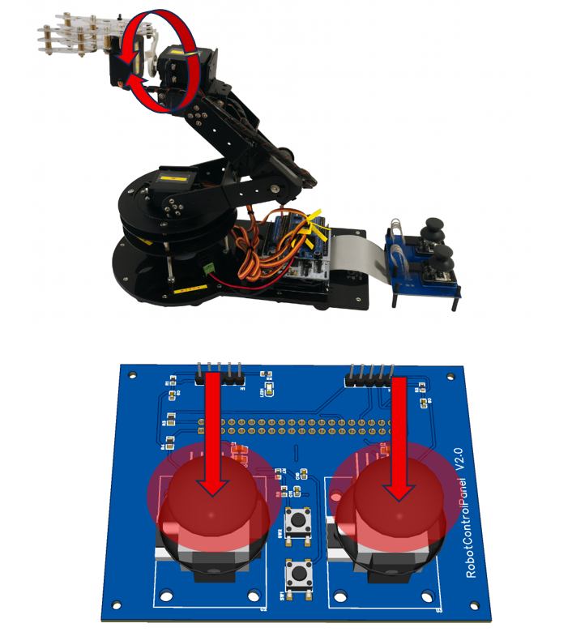
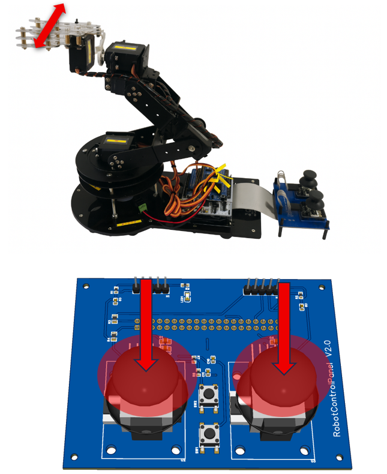
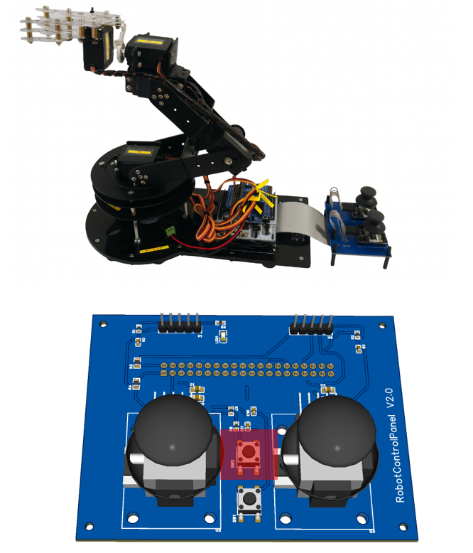
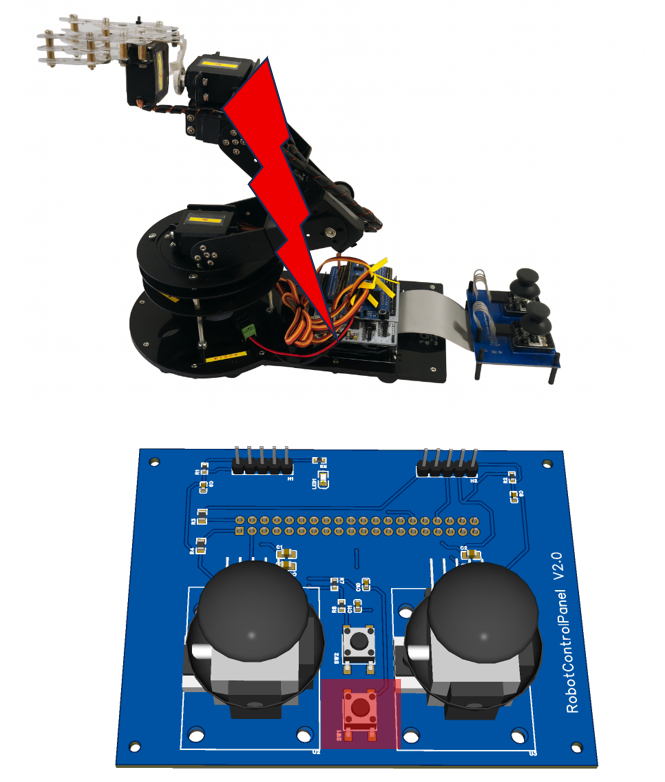

# Robotic Arm User Manual

This document describes the operation and safe use of the robotic arm system.

The robotic arm is designed for automated picking, transportation and precise placement of workpieces between defined positions.

The system supports:

- Manual joystick control  
- Remote Cartesian targets via HC-05 in manual mode
- Automatic execution of predefined motion sequences  

---

## Image Attribution

Some figures in this document include a joystick 3D model.

The joystick model “Joystick KY-023” by Thingiverse user UniversalXx  
is licensed under Creative Commons Attribution-ShareAlike (CC-BY-SA).

Model source: https://www.thingiverse.com/thing:7005492

---

## System Startup and Referencing

After power-up the robotic arm automatically performs a referencing procedure.

All axes move to their defined home positions to establish a consistent internal coordinate reference.

⚠️ Do not interfere with the robot during referencing.

The system is ready for operation only after successful completion.

<div align="center">



<em>Figure: Axis configuration and designation of the robotic arm.</em>

</div>

---

## Axis Overview

### Axis 1 – Base Rotation (A1)

Rotates the entire robotic arm around the vertical axis.

<div align="center">



<em>Figure: Axis 1 – base rotation.</em>

</div>

### Axis 2 – Shoulder Axis (A2)

Moves the arm vertically and defines working height.

<div align="center">



<em>Figure: Axis 2 – shoulder movement.</em>

</div>

### Axis 3 – Elbow Axis (A3)

Extends or retracts the arm and enables positioning in depth direction.

<div align="center">



<em>Figure: Axis 3 – elbow movement.</em>

</div>

### Axis 4 – Tool Tilt Axis (A4)

Tilts the gripper up and down to adjust tool orientation.

<div align="center">



<em>Figure: Axis 4 – gripper tilt.</em>

</div>

### Axis 5 – Wrist Rotation (A5)

Rotates the gripper around its longitudinal axis.

**Activation**

Press both joystick push buttons simultaneously while both joysticks are in the neutral position.

After activation:

- Press left joystick → rotate in one direction  
- Press right joystick → rotate in opposite direction  

<div align="center">



<em>Figure: Axis 5 – wrist rotation control.</em>

</div>

### Axis 6 – Gripper (G6)

Opens and closes the gripper for workpiece handling.

**Activation**

Press both joystick push buttons simultaneously to switch from wrist rotation mode back to gripper control mode.

- Press left joystick → open gripper  
- Press right joystick → close gripper  

<div align="center">



<em>Figure: Gripper opening and closing.</em>

</div>

---

## Motor Assignment

The robotic arm is driven by six servo motors.

Each motor is assigned to one axis or the gripper function.

| Motor No. | Axis / Function | Description |
|-----------|----------------|-------------|
| Motor 0 | A1 – Base Rotation | Rotates the robotic arm around the vertical axis |
| Motor 1 | A2 – Shoulder Axis | Moves the arm up and down to define working height |
| Motor 2 | A3 – Elbow Axis | Extends or retracts the arm for depth positioning |
| Motor 3 | A4 – Tool Tilt Axis | Tilts the gripper to adjust tool orientation |
| Motor 4 | A5 – Wrist Rotation | Rotates the gripper around its longitudinal axis |
| Motor 5 | G6 – Gripper | Opens and closes the gripper |

Motor numbering starts at **Motor 0** and ends at **Motor 5**.

Axes **A1 to A5** control spatial movement.  
**G6** controls the gripping function.

---

## Operating Modes

### Manual Mode

In **Manual Mode**, the robotic arm accepts joystick input and remote target commands.
Each remote movement takes priority until completed. Queued targets run in FIFO order;
when none are waiting, joystick control resumes. Joystick input does not alter an active
remote movement. The emergency-stop button remains effective.

- Joystick movement controls axis direction and speed  
- Push buttons control tool functions  

Manual Mode is intended for:

- Setup and adjustment  
- Testing movements  
- Maintenance  
- Teaching positions  

### Remote Target Commands (HC-05)

Connect HC-05 TX to PA3 (USART2 RX), PA2 (USART2 TX) to HC-05 RX, and share GND.
Use 3.3 V-compatible UART logic and ensure no other output (such as the onboard
debugger's virtual COM TX) drives PA3. The serial configuration is **9600 baud, 8N1**.

Send one ASCII command per line, for example:

```text
@MOVE(#123) x=100 y=0 z=100
```

Terminate the line with an actual **LF byte (0x0A, `\n`)** or CRLF. Neither `/n`
nor the literal characters `\` and `n` terminate a command.

- The required prefix and field order are exact: `@MOVE(#ID) x=X y=Y z=Z`.
  Optional `tilt=`, `rotation=` and `gripper=` fields may follow in any order,
  separated by single spaces. Each optional field may occur at most once.
- ID: decimal integer from 1 to 2147483647.
- X/Y/Z: integer millimetres, each from -1000 to 1000; negative values are allowed.
  These parser bounds are not the reachable workspace: the configured arm geometry
  and servo limits are checked separately.
- X/Y/Z control M0/M1/M2. Optional angles directly control M3/M4/M5 as listed below.
  Omitted angles retain their current commanded position when the queued command
  starts, including changes made by preceding commands.
- The existing elbow-up IK solution is used. Unreachable targets or angles outside
  configured servo limits are rejected, not silently clamped. Angles are converted
  to integer degrees as in the existing controller.
- The movement uses 1-degree steps at a nominal 60 ms interval, serviced by the
  existing periodic controller. It does not block the controller loop.
- Maximum line length is 95 bytes before LF, including an optional CR.
- The interrupt stores up to 8 complete received lines, plus a partial incoming line.
  The controller reads one line per cycle, including during motion. Parsed motion
  commands wait in a separate FIFO with 8 slots, in addition to the active movement.
  This lets status queries be answered without waiting for movements to finish.
  An unfinished line never executes.

Optional angles are **absolute servo angles in integer degrees**, not relative
increments, gripper opening percentages or tool orientation in world coordinates.
Syntax accepts 0 through 180; the active robot variant's narrower servo limits
are then checked before any axis is moved. Unknown or duplicate parameters,
negative angles and fractional values are rejected as `INVALID_COMMAND`.
Any angle outside the configured servo limits rejects the entire command with
`SERVO_LIMIT`; no partial movement is started.

| Parameter | Motor / function | Limits for currently selected Robot A |
|-----------|------------------|---------------------------------------|
| `tilt` | M3 / tool tilt | 50 to 130 degrees |
| `rotation` | M4 / wrist rotation | 10 to 160 degrees |
| `gripper` | M5 / gripper | 40 to 120 degrees |

Examples (append LF or CRLF in the terminal):

```text
@MOVE(#124) x=100 y=0 z=100 gripper=80
@MOVE(#125) x=100 y=0 z=100 tilt=110 rotation=80 gripper=40
```

All specified axes step toward their targets together; gripper motion is not
delayed until the Cartesian target is reached. To move first and grip afterward,
send two queued commands: the first with the target X/Y/Z and no gripper parameter,
the second with the same X/Y/Z and the desired `gripper` angle.

Responses share the UART with debug logs:

```text
@QUEUED(#123)
@ACK(#123)
@DONE(#123)
@ERR(#124) code=UNREACHABLE
```

`QUEUED` confirms a syntactically valid motion command was saved in the motion FIFO.
`ACK` means the command has been dequeued, validated and accepted for execution,
not merely received. `DONE` means all commanded PWM positions have been issued;
there is no physical position feedback or collision/path validation.
The host should normally send one movement and wait for `DONE` or `ERR` before
sending the next movement. It may request status in between, but must wait for
`STATUS_END` before issuing another query. IDs correlate responses only; they do not provide deduplication.
Do not blindly retry after a timeout, since a command may already have moved the arm.

Errors include `INVALID_COMMAND`, `UNREACHABLE`, `SERVO_LIMIT`, `LINE_TOO_LONG`,
`INVALID_BYTE`, `UART_ERROR`, `RX_DISABLED`, `AUTO_MODE`, `MODE_BUTTON`, `ESTOP`
and `MOTION_QUEUE_FULL`.
For malformed/damaged lines, the response uses ID `0` because the original ID cannot
be trusted. Receive queue overflow is reported as
`@ERR(#0) code=RX_QUEUE_FULL count=N`, where N is the number of dropped lines since
the last report. The newest line is dropped, not an older queued command. A full motion
FIFO instead returns `@ERR(#ID) code=MOTION_QUEUE_FULL` for the rejected motion.
Neither queue overwrites an older entry. Overlong or corrupt lines are discarded
through the next LF so their suffix cannot become a command.

There is no unlimited or power-loss-persistent storage, transport authentication,
deduplication or hardware flow control. To avoid overflow, obey the request/response
pacing above. For pipelining, wait for each `QUEUED`/`ERR` before sending another
request and track outstanding motions; never assume a transmitted line was accepted.
An explicit `MOTION_QUEUE_FULL` means that particular motion was not stored.
After a timeout or unidentified `RX_QUEUE_FULL`, stop sending and reconcile state;
blindly resending movements is unsafe.

Entering automatic mode or pressing emergency stop aborts the active remote target
and rejects pending targets. Motion commands received during startup, automatic operation,
emergency stop or a held mode button are not saved for later execution. Motion permission
is recorded with each line, so a later mode change cannot turn a disallowed line into an
executable motion. Status queries remain available in manual mode, automatic mode and
emergency stop (startup queries are answered after initialization).
Releasing emergency stop does not resume aborted remote targets.

The automatic transport sequence now advances one servo step at a time in the
controller loop, with the same seven stages, target positions and nominal 60 ms step
interval as before. RX commands and the physical mode/stop buttons are checked between
steps instead of only between complete transport sequences. Switching out of automatic
mode stops further automatic updates at the current commanded position. Re-entering
automatic mode, or releasing emergency stop while still in automatic mode, starts
the sequence again at stage 0.

The existing emergency-stop input inhibits further PWM updates; it does **not**
disconnect servo power. Logs still use blocking UART TX, so this is not a hard
real-time safety mechanism. First test reception with servo power disconnected,
then test supervised in a clear workspace. Check calibration and mechanical limits
before allowing remote motion.

#### Reading the Robot State

Send the following with LF or CRLF; the ID uses the same range as movement IDs:

```text
@STATUS(#200)
```

The request goes through the same interrupt RX FIFO. When its turn arrives in the
controller loop, it is answered immediately, without waiting for an active movement
or the motion FIFO to finish. Earlier RX lines are still read first, one per cycle.
It does not change target positions or cancel a movement.

The response consists of seven LF-terminated lines carrying the same ID, for example:

```text
@STATUS(#200) mode=MANUAL estop=0 mode_button=0 busy=1 active=123 auto_step=-1
@POSITION(#200) x=99 y=0 z=100 tx=79 ty=69 tz=51
@ANGLES(#200) m0=98 m1=80 m2=122 tilt=110 rotation=80 gripper=80
@TARGETS(#200) m0=139 m1=90 m2=140 tilt=60 rotation=80 gripper=40
@INPUTS(#200) lx=2048 ly=2048 lb=0 rx=2048 ry=2048 rb=0 buttons=GRIPPER
@QUEUE(#200) motion=2 motion_cap=8 rx=0 rx_cap=8 uptime_ms=12345
@STATUS_END(#200)
```

- `mode`: `MANUAL` or `AUTO`; `estop` and `mode_button`: sampled physical inputs (0/1).
- `busy`: an active remote movement or automatic movement stage (0/1).
  It is not a physical motion sensor and does not describe instantaneous joystick motion.
- `active`: current remote movement ID, or 0 if none. It is not the status request ID.
- `auto_step`: automatic stage 0 through 6, or -1 in manual mode. Stages are open
  gripper, approach pick position, close, transit, approach place position, open, return.
  When an automatic stage completes, this identifies the next stage.
- `POSITION`: forward-kinematic current and target XYZ in integer millimetres;
  `tx/ty/tz` are derived from the quantized target servo angles.
- `ANGLES` / `TARGETS`: all six current commanded / target servo angles in degrees.
  `tilt`, `rotation`, `gripper` are M3, M4, M5.
- `INPUTS`: left/right joystick ADC values and push buttons. `buttons` identifies
  whether joystick push buttons currently control the gripper or wrist rotation.
- `QUEUE`: waiting parsed motions (excluding the active motion), waiting RX lines
  (excluding this query), both capacities and snapshot time in milliseconds since boot.
  The 32-bit clock wraps after about 49.7 days.
- `STATUS_END` marks a complete snapshot. There is no separate `ACK`/`DONE` for a query.

These are **software-commanded positions, not encoder measurements**. XYZ describes
the existing two-link kinematics, not a compensated gripper-tip pose. The snapshot is
taken when the query is serviced, not when its last output byte reaches the host.
At 9600 baud the roughly 500-byte response takes about half a second; current UART TX
is blocking, so it lengthens that controller cycle and delays subsequent servo steps.
Do not poll continuously or assume a hard 10 ms response/motion deadline.

#### API / MCP Host Integration

The MCU does not speak HTTP or MCP. MCP (Model Context Protocol) is a host-side
integration option: an MCP-compatible client can ask a separate server to expose
robot operations as tools, and that server can translate requests into the serial
command format above and return the corresponding responses. This lets a host
application or assistant use the existing robot interface without implementing MCP
in the firmware; it does not make the robot itself an MCP or network endpoint.

The host server must open the paired HC-05 serial port, serialize requests into the
command format above, and read responses by ID. Existing `@IK(#99)` output remains
telemetry and is **not** accepted as an RX command. Ignore ordinary debug text when
parsing protocol responses. This repository implements the firmware endpoint and
contains MCP client connection configuration, but does not include the external MCP
server or provide an authentication layer for serial commands. Only allow trusted
clients to access the serial connection. The MCP authorization value is supplied
from the local environment; never put the secret itself in a public configuration
file or documentation.

<div align="center">


<em>Figure: Manual operation using the dual-joystick control panel.</em>

</div>

### Automatic Mode

In **Automatic Mode**, the robotic arm executes predefined motion sequences.

Typical process:

1. Move to pick position  
2. Grip workpiece  
3. Transport along programmed path  
4. Place workpiece at target position  

Manual joystick inputs are disabled during automatic operation.

<div align="center">



<em>Figure: Automatic workpiece transport cycle.</em>

</div>

---

## Emergency Stop

The system includes an emergency stop function.

When activated:

- Further servo PWM updates are inhibited after the controller detects the stop input.
- Servo power is not disconnected, so the arm may still move due to inertia, gravity or load.
- Blocking UART output can delay the controller's next input check; this is not a safety-rated emergency stop.

Before restarting operation:

- Inspect the system  
- Resolve the cause of the stop condition  

<div align="center">



<em>Figure: Emergency stop button on control panel.</em>

</div>

---